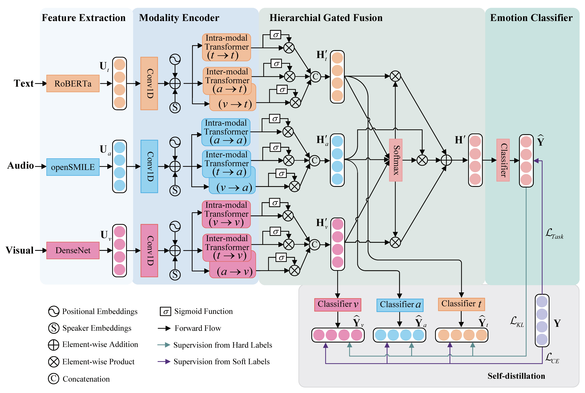

# TEN
This repository is the implementation for our paper *[A Transformer-based Model with Self-distillation for Multimodal Emotion Recognition in Conversations](https://ieeexplore.ieee.org/abstract/document/10109845)*.

## Model Architecture
<!--  -->
<div align="center">
    
</div>

## Setup
- Check the packages needed or simply run the command:
```console

pip install -r requirements.txt
```
- Download the preprocessed datasets from [here](https://drive.google.com/drive/folders/1J1mvbqQmVodNBzbiOIxRiWOtkP6qqP-K?usp=sharing), and put them into `data/`.

## Run TEN model
- Run the model on IEMOCAP dataset:
```console

bash exec_iemocap.sh
```
- Run the model on MELD dataset:
```console

bash exec_meld.sh
```

## Integrated RAG-VAD Reasoning Fusion
This project uses one integrated reasoning path:
`multimodal RAG retrieval -> Qwen2.5 reasoning -> VAD/appraisal + modality reliability -> cognitive residual TEN fusion -> VAD-aware contrastive training`.

Supported labels:
- IEMOCAP: `happy`, `sad`, `neutral`, `angry`, `excited`, `frustrated`
- MELD: `neutral`, `surprise`, `fear`, `sadness`, `joy`, `disgust`, `anger`

Export utterance-level prompts from the preprocessed dataset:
```console
/home/zzb/anaconda3/envs/ten_1/bin/python export_llm_prompts.py \
  --Dataset IEMOCAP \
  --output data/iemocap_llm_prompts.jsonl
```

Generate the integrated cache. Each record stores the prediction, VAD/appraisal, modality hint, current audio/visual statistics, retrieved training examples, and retrieval quality. Use a fresh output file for the multimodal RAG version instead of resuming an older text-only cache:
```console
CUDA_VISIBLE_DEVICES=1 /home/zzb/anaconda3/envs/ten_1/bin/python generate_llm_reasoning_rag.py \
  --Dataset IEMOCAP \
  --prompts data/iemocap_llm_prompts.jsonl \
  --output data/iemocap_llm_reasoning_mmrag.jsonl \
  --model-path /data/LLM/Qwen2.5-7B-Instruct \
  --rag-k 5 \
  --context-window 3 \
  --text-rag-weight 0.7 \
  --dtype bf16 \
  --resume
```

Train TEN with cognitive residual fusion. RAG quality weights LLM distillation, VAD plus modality hints supervise the reliability gate, and VAD-aware contrastive learning separates common confusing emotion pairs:
```console
CUDA_VISIBLE_DEVICES=1 /home/zzb/anaconda3/envs/ten_1/bin/python -u train.py \
  --Dataset IEMOCAP \
  --llm-cache data/iemocap_llm_reasoning_mmrag.jsonl \
  --use-llm-reasoning \
  --llm-loss-weight 0.01 \
  --llm-reliability-weight 0.005 \
  --vad-contrast-weight 0.003
```

## Acknowledgements
- Special thanks to the [COSMIC](https://github.com/declare-lab/conv-emotion) and [MMGCN](https://github.com/hujingwen6666/MMGCN) for sharing their codes and datasets.

## Citation
If you find our work useful for your research, please kindly cite our paper. Thanks!
```
@article{ma2024ten,
  author={Ma, Hui and Wang, Jian and Lin, Hongfei and Zhang, Bo and Zhang, Yijia and Xu, Bo},
  journal={IEEE Transactions on Multimedia}, 
  title={A Transformer-Based Model With Self-Distillation for Multimodal Emotion Recognition in Conversations}, 
  year={2024},
  volume={26},
  number={},
  pages={776-788},
  keywords={Emotion recognition;Transformers;Oral communication;Context modeling;Task analysis;Visualization;Logic gates;Multimodal emotion recognition in conversations;intra- and inter-modal interactions;multimodal fusion;modal representation},
  doi={10.1109/TMM.2023.3271019}}

```
